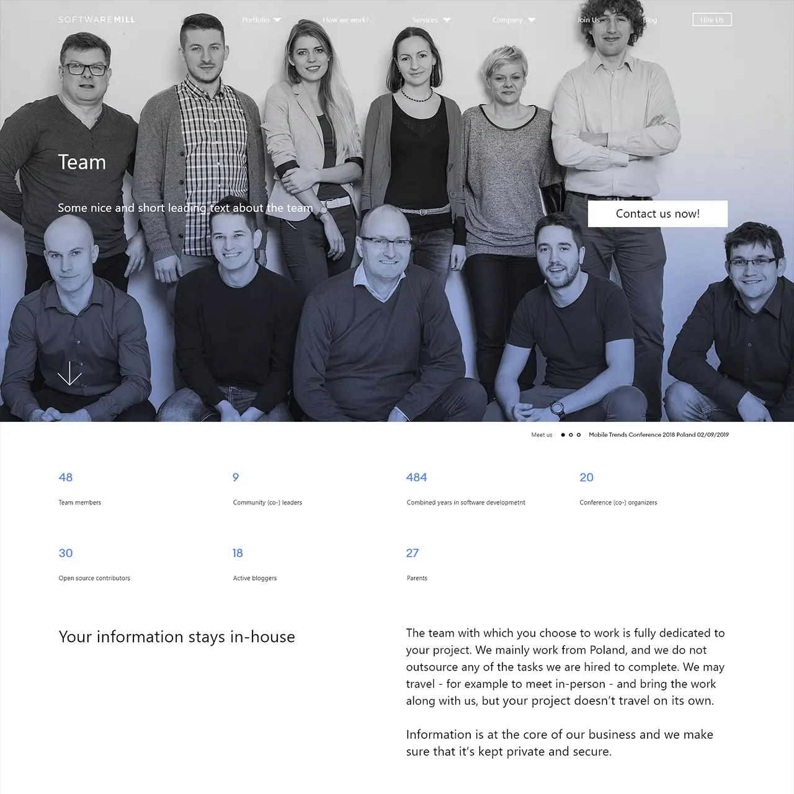

# softwaremill

Front-end development based on Adobe XD files provided by the external client

## Preview
* [Homepage](https://piotrmerton.github.io/softwaremill/index.html)
* [How We Work](https://piotrmerton.github.io/softwaremill/how-we-work.html)
* [Company - Team](https://piotrmerton.github.io/softwaremill/company-team.html)
* [Company - Remote](https://piotrmerton.github.io/softwaremill/company-remote.html)
* [Company - Scala](https://piotrmerton.github.io/softwaremill/company-scala.html)
* [Company - Community](https://piotrmerton.github.io/softwaremill/company-community.html)
* [Services list](https://piotrmerton.github.io/softwaremill/services.html)
* [Service single](https://piotrmerton.github.io/softwaremill/service-template.html)
* [Portfolio - Clients](https://piotrmerton.github.io/softwaremill/portfolio-clients.html)
* [Portfolio - Open Source](https://piotrmerton.github.io/softwaremill/portfolio-open-source.html)
* [Portfolio - Products](https://piotrmerton.github.io/softwaremill/portfolio-products.html)
* [Ebook](https://piotrmerton.github.io/softwaremill/ebook.html)
* [Blog](https://piotrmerton.github.io/softwaremill/blog.html)
* [Blog post](https://piotrmerton.github.io/softwaremill/blog-post.html)
* [Join Us](https://piotrmerton.github.io/softwaremill/join-us.html)
* [Contact](https://piotrmerton.github.io/softwaremill/contact.html)

